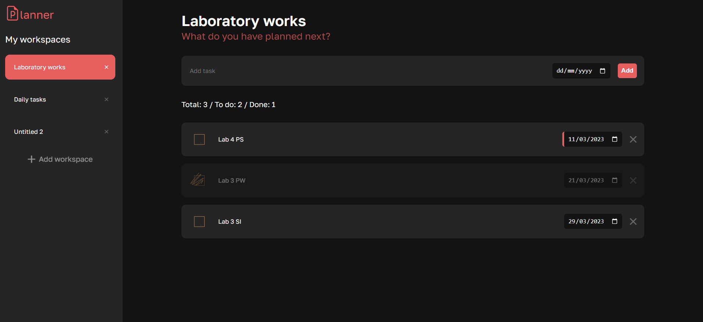

# Lab 3 - Learn JavaScript basics

#### Active on:   https://valeriadd.github.io/Planner/

## Story

Imagine, you're a frontend developer from Melbourne, Australia. You and your company Sleep2nigth Pty Ltd are working on a brand new product - smart To-do lists!

You've pitched the idea in the local startup accelerator and you've won first round of investitions. The only thing what's left - to build the app itself.

## Task

1. Copy [index.html](index.html), [style.css](style.css) and [app.js](app.js) to your repo;
2. Modify them to build an application for to-do list;
3. The app has to cover basic needs:
  - to add to the list;
  - to remove from the list;
  - to mark as done;
  - see "done" and "to-do" lists separately.

4. The app has to look attractive.

## Special conditions

You're not allowed to use any third-party library for JS, except utility packages such as `lodash` or `underscore`. `jquery` is not allowed. If you use third-party CSS libraries/frameworks, make sure they don't use JS.

## Results

## Implemented features

- Delimitation of the tasks by workspaces
- Possibility to add as many workspaces as needed
- Workspace title editing
- Delete a workspace and Remove all tasks from it with a confirmation notice
- Add task with title and optional due date
- Handle empty title
- Handle unselected active workspace
- Display of the tasks based on active workspace
- Task edit (title, due date and status)
- Different design for overdue tasks
- Different design for complete tasks
- Total, To do, Done task counter per workspace
- Task ordering by due date
